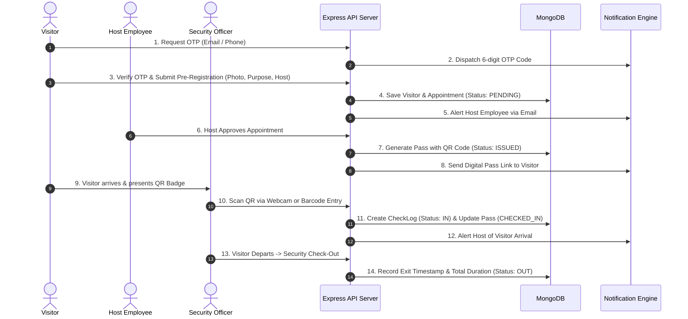

# PassPulse — Digital Visitor Pass Management System (MERN Stack)

> 🚀 **Live Production Deployment**: [https://visitor-pass-5244.web.app](https://visitor-pass-5244.web.app)  

PassPulse is an enterprise-grade **Visitor Pass Management System** built with the **MERN Stack** (MongoDB, Express, React, Node.js). Designed to replace archaic paper entry logs, PassPulse digitizes the complete visitor lifecycle: public pre-registration, OTP verification, host approval workflows, cryptographic QR badge generation, live webcam check-in/out scanning, overstay alerts, audit trails, and multi-campus support.

---

## Architecture & System Workflow



---

## User Roles & Demo Credentials

| Role | Email | Password | Primary Capabilities |
| :--- | :--- | :--- | :--- |
| **Admin** | `admin@visitorpass.com` | `Admin@123` | System analytics, staff account provisioning, security audit logs, CSV exports, multi-tenant organizations. |
| **Security / Frontdesk** | `security@visitorpass.com` | `Security@123` | Live QR camera scanner, instant check-in/out, active inside roster, overstay alerts, emergency evacuation roll call. |
| **Host (Engineering)** | `host@visitorpass.com` | `Host@123` | Review visitor requests, approve/reject with remarks, invite visitors with pre-authorized passes. |
| **Host (HR)** | `hr@visitorpass.com` | `Host@123` | Interview visitor approvals, candidate scheduling, visit history. |
| **Visitor (Public)** | *Self-Service Kiosk* | *N/A (OTP)* | Pre-register at `/public-register`, webcam selfie capture, 6-digit OTP, download PDF badge. |

> **Tip:** The login page features a **1-Click Evaluation Login Bar** allowing instant role switching without typing credentials.

---

## Key Features & Requirement Mapping

### 1. Authentication & Role-Based Authorization
- Secure JWT (JSON Web Token) issuance with password hashing via `bcryptjs`.
- Role-based middleware (`protect`, `authorizeRoles('admin', 'security', 'employee')`).

### 2. Visitor Pre-Registration & Photo Capture
- Public kiosk interface (`/public-register`) with zero login requirement.
- Capture badge photos using **live webcam video snapshot** or file upload.
- Captures Govt ID Type (Passport, National ID, Driving License, Aadhaar) and number.

### 3. OTP-Based Verification (Bonus Challenge)
- 6-digit timed OTP generation with 5-minute TTL.
- Dispatched via simulated Email and SMS services.
- Demo bypass code `999999` or dynamic code display in evaluation mode.

### 4. Digital Pass Issuance (QR Code + PDF Badge)
- Human-readable unique pass numbers: `VP-2026-XXXXX`.
- High-contrast scannable QR Code generation with error correction level `H`.
- Official **PDF Badge Generation & Streaming** powered by `pdfkit` (downloadable via `/api/passes/:id/pdf`).
- Physical badge layout with lanyard hole, organization banner, visitor photo, validity window, and security rules.

### 5. Check-In / Check-Out & Live Security Desk
- **Live Camera QR Scanner** using `html5-qrcode`.
- **Manual / Barcode Scanner fallback** for fast entry with 1-click test fill buttons.
- Real-time active inside roster with automatic stay duration counter.
- **Automated Overstay Detection**: Flags visitors whose stay exceeds scheduled validity in flashing crimson.
- 1-Click Check-Out directly from the security table.

### 6. Notifications Engine (Email / SMS)
- Integrated notification dispatcher with Nodemailer SMTP and simulated SMS engine.
- Real-time in-app notification drawer accessible via the bell icon in the top navbar.
- Triggers notifications on:
  - OTP dispatch
  - Pre-registration submitted
  - Pass approved / issued
  - Visitor checked in at Gate
  - Visitor departed

### 7. Dashboard, Analytics & CSV Export
- Interactive KPI metric cards (Total Visitors, Currently Inside, Today's Check-ins, Overstay Alerts).
- **Peak Entry Traffic Histogram**: Visual distribution of arrivals between 08:00 and 18:00.
- **Visit Category Breakdown**: Proportion of Meetings, Interviews, Deliveries, and Contractors.
- One-click **CSV Report Export** (`/api/reports/export/csv`).

### 8. Multi-Organization & Multi-Location Support (Bonus Challenge)
- Tenant configuration for parent organizations and branches/campuses (e.g. `HQ Tech Tower`, `Innovation Hub`).
- Gate zone definitions (`Main Entrance`, `VIP Gate`, `North Turnstile`, `Basement Parking`).

### 9. Security Audit Logging (Bonus Challenge)
- Compliance-ready `AuditLog` collection capturing actor, role, action, resource, IP address, and timestamps for all critical system actions.

### 10. Containerized Deployment (Docker + Nginx) (Bonus Challenge)
- `Dockerfile.backend` (Node 22 runtime)
- `Dockerfile.frontend` (Multi-stage build with Nginx)
- `docker/nginx.conf` (Reverse proxy for API & SPA routing)
- `docker-compose.yml` (Orchestrates MongoDB, Backend, and Frontend)

---

## Project Structure

```text
Visitor_Pass_Management_System/
├── backend/
│   ├── config/
│   │   └── db.js                 # MongoDB connection logic
│   ├── controllers/
│   │   ├── authController.js     # User registration, login, staff roster
│   │   ├── visitorController.js  # Pre-registration, OTP, photo uploads
│   │   ├── appointmentController.js # Host invites, approve/reject
│   │   ├── passController.js     # Pass details, QR verification, PDF stream
│   │   ├── checkLogController.js # Security QR check-in/out, inside roster
│   │   ├── reportController.js   # Analytics, KPIs, CSV export, audit logs
│   │   └── organizationController.js # Multi-org and branch manager
│   ├── middleware/
│   │   ├── authMiddleware.js     # JWT verification & role authorization
│   │   ├── uploadMiddleware.js   # Multer image upload handler
│   │   ├── auditMiddleware.js    # System audit logger
│   │   └── errorMiddleware.js    # Centralized JSON error handler
│   ├── models/
│   │   ├── User.js               # Admin, Security, Host models
│   │   ├── Visitor.js            # Visitor profile & contact info
│   │   ├── Appointment.js        # Schedule, purpose, approval state
│   │   ├── Pass.js               # QR tokens, pass numbers, validity
│   │   ├── CheckLog.js           # Ingress/egress logs, gates, duration
│   │   ├── Organization.js       # Enterprise entities & branches
│   │   └── AuditLog.js           # Security audit trail
│   ├── routes/                   # Express REST route definitions
│   ├── utils/
│   │   ├── qrHelper.js           # QR code data URL generator
│   │   ├── pdfGenerator.js       # PDFKit badge streaming engine
│   │   ├── notificationHelper.js # Email & SMS dispatcher
│   │   └── otpHelper.js          # 6-digit OTP generator with TTL
│   ├── seed/
│   │   └── seedData.js           # Realistic test data generator
│   ├── verifyE2E.js              # Automated E2E functional test suite
│   ├── package.json
│   └── server.js
├── frontend/
│   ├── src/
│   │   ├── components/
│   │   │   ├── Navbar.jsx        # Top control bar with alerts & profile
│   │   │   ├── Sidebar.jsx       # Role-aware responsive navigation
│   │   │   ├── QRScannerModal.jsx# Live webcam scanner & manual barcode entry
│   │   │   ├── PassBadge.jsx     # Printable lanyard badge card
│   │   │   ├── StatCard.jsx      # KPI dashboard widget
│   │   │   ├── StatusPill.jsx    # Status indicators
│   │   │   ├── Modal.jsx         # Accessible modal dialog
│   │   │   └── NotificationDrawer.jsx # Dispatched email/sms drawer
│   │   ├── context/
│   │   │   ├── AuthContext.jsx   # Role state & 1-click logins
│   │   │   └── NotificationContext.jsx # Global toasts & notifications
│   │   ├── pages/
│   │   │   ├── Login.jsx         # Authentication & role switcher
│   │   │   ├── Register.jsx      # Staff self-signup
│   │   │   ├── PublicVisitorPass.jsx # Visitor kiosk & OTP verification
│   │   │   ├── PassView.jsx      # Digital badge view & PDF download
│   │   │   ├── SecurityDashboard.jsx # Security desk, inside roster, scanner
│   │   │   ├── HostDashboard.jsx # Host appointments & visitor invites
│   │   │   ├── AdminDashboard.jsx# Analytics, staff, audit logs
│   │   │   ├── ReportsPage.jsx   # Charts, filters, CSV export
│   │   │   └── OrganizationsPage.jsx # Multi-tenant manager
│   │   ├── services/
│   │   │   └── api.js            # Universal API client
│   │   ├── styles/
│   │   │   └── index.css         # Rich bespoke Vanilla CSS design system
│   │   ├── App.jsx               # Routes & protected layout guards
│   │   └── main.jsx
│   ├── index.html
│   └── package.json
├── docker/
│   ├── Dockerfile.backend
│   ├── Dockerfile.frontend
│   └── nginx.conf
├── docker-compose.yml
└── README.md
```

---

## Getting Started & Local Setup

### Prerequisites
- [Node.js](https://nodejs.org/) v18+ (tested on v22.20)
- [MongoDB](https://www.mongodb.com/) running locally on port `27017` (or MongoDB Atlas connection string)

### 1. Clone & Configure Backend
```bash
cd backend
npm install
```
Verify the `.env` file configuration (pre-configured for local MongoDB):
```env
PORT=5000
NODE_ENV=development
MONGO_URI=mongodb://127.0.0.1:27017/visitor_pass_db
JWT_SECRET=super_secret_visitor_pass_jwt_key_2026_production_ready
CLIENT_URL=http://localhost:5173
```

### 2. Seed Realistic Demo Data
Populate the database with pre-configured organizations, admins, security guards, host employees, pending visitors, active inside visitors, and overstay alerts:
```bash
npm run seed
```

### 3. Run Automated E2E Verification
Execute the 14-step automated verification test verifying all auth, pre-registration, OTP, approval, QR scan, PDF, and CSV features:
```bash
node verifyE2E.js
```

### 4. Start the Backend API Server
```bash
npm start
# Server listens on http://localhost:5000
```

### 5. Setup & Start the Frontend
In a new terminal window:
```bash
cd frontend
npm install
npm run dev
# App opens on http://localhost:5173
```

---

## Running with Docker & Nginx

To spin up the entire system (MongoDB + Express Backend + React with Nginx reverse proxy) in containers:

```bash
docker compose up --build
```
- Web Application: `http://localhost`
- Backend API Proxy: `http://localhost/api/`
- MongoDB: `localhost:27017`

For full cloud deployment options (Render, Railway, MongoDB Atlas, Vercel), see **[DEPLOYMENT.md](file:///c:/Users/saddam/OneDrive/Desktop/Visitor_Pass_Management_System/DEPLOYMENT.md)**.

---

## API Endpoints Reference

### Authentication & Users
- `POST /api/auth/register` — Register a staff account
- `POST /api/auth/login` — Sign in & receive JWT token
- `GET  /api/auth/me` — Get current profile
- `GET  /api/auth/hosts` — Public listing of hosts for visitor registration
- `GET  /api/auth/users` — Admin staff directory

### Visitors & Pre-Registration
- `POST /api/visitors/otp/request` — Dispatch 6-digit OTP to email/phone
- `POST /api/visitors/otp/verify` — Validate OTP code
- `POST /api/visitors/register` — Submit visitor pre-registration with photo & ID proof
- `POST /api/visitors/upload-photo` — Upload badge photo
- `GET  /api/visitors` — List registered visitors

### Appointments & Host Workflows
- `GET  /api/appointments` — List appointments (scoped to host or all for security/admin)
- `POST /api/appointments/invite` — Host directly invites a visitor
- `PUT  /api/appointments/:id/approve` — Approve visitor appointment & generate QR pass
- `PUT  /api/appointments/:id/reject` — Reject appointment with reason

### Passes & Badges
- `GET  /api/passes/:id` — Retrieve digital pass details
- `GET  /api/passes/number/:passNumber` — Lookup pass by badge number
- `GET  /api/passes/:id/pdf` — Download official printable PDF badge
- `POST /api/passes/verify-qr` — Decrypt and validate scanned QR token
- `GET  /api/passes` — List all passes with status filters

### Check-In / Check-Out (Security)
- `POST /api/checklogs/check-in` — Security checks in visitor via QR/pass code
- `POST /api/checklogs/check-out` — Security checks out visitor & computes duration
- `GET  /api/checklogs/inside` — Live active inside roster & overstay flags
- `GET  /api/checklogs` — Chronological access logs

### Reports & Compliance
- `GET  /api/reports/stats` — Dashboard KPIs
- `GET  /api/reports/analytics` — Peak hours & category distribution
- `GET  /api/reports/export/csv` — Stream CSV visitor logs
- `GET  /api/reports/audit-logs` — Security audit logs
- `GET  /api/organizations` — Multi-tenant organization & campus listing
